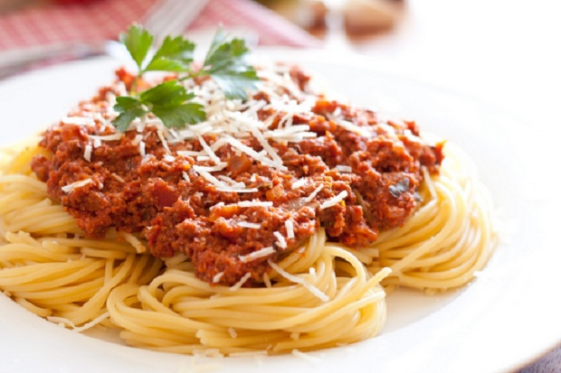
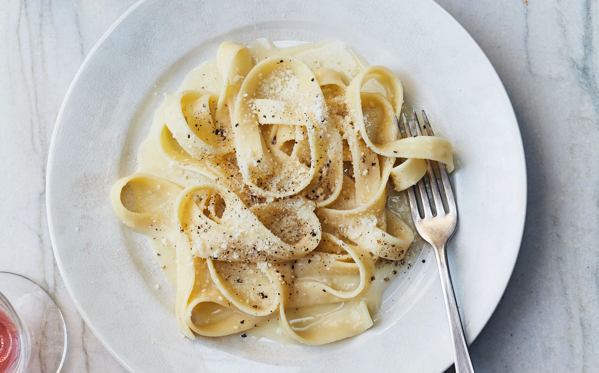
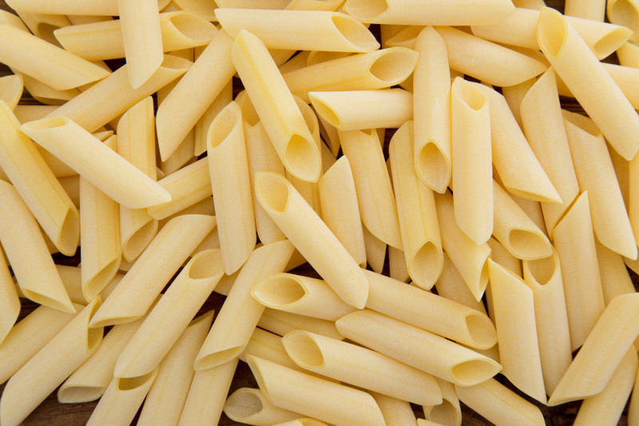
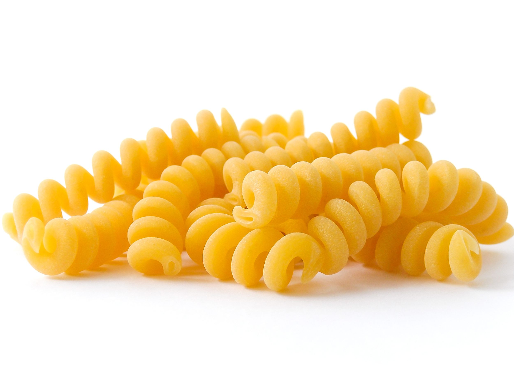
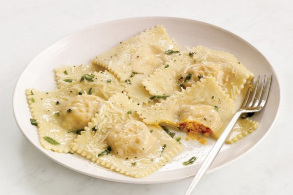
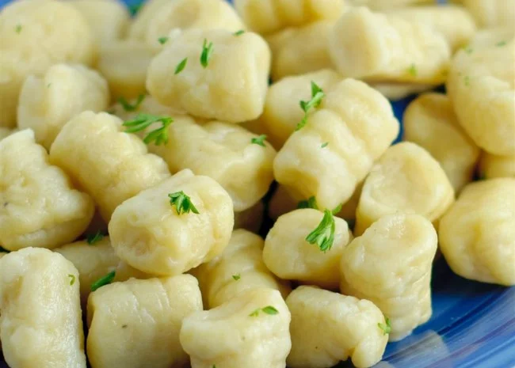
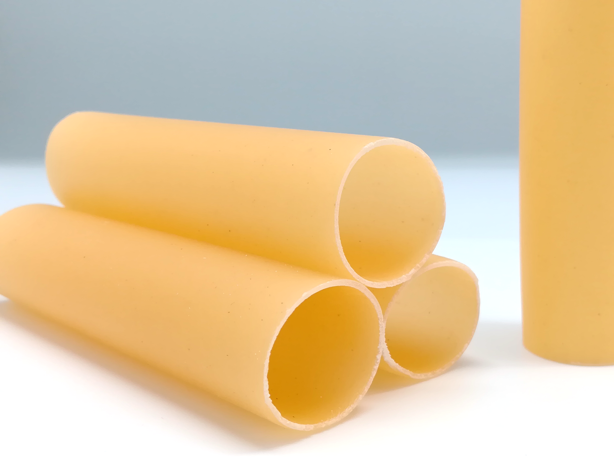
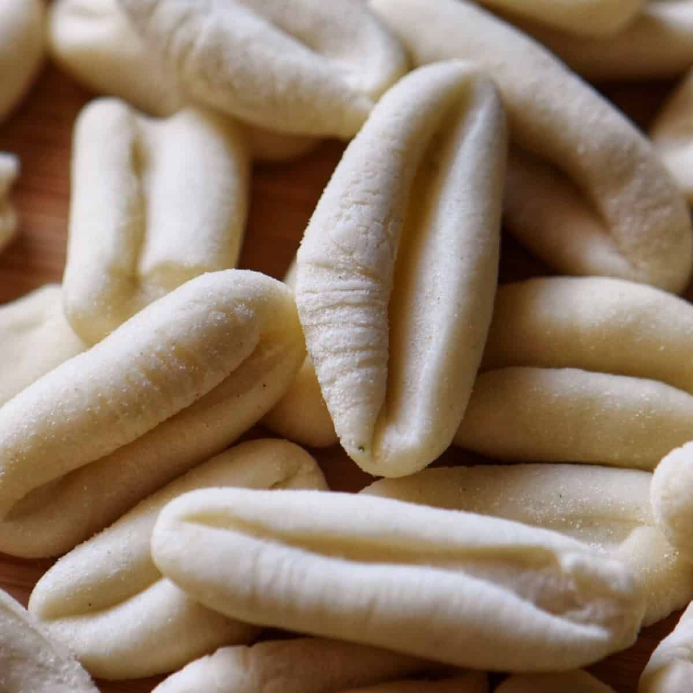
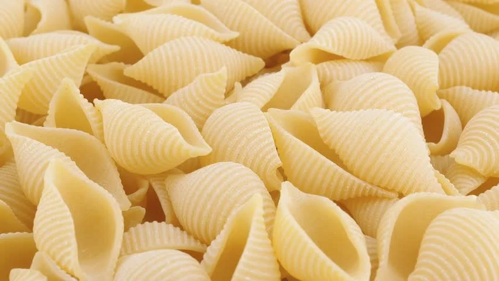

---

title: "Different Types of Pasta"
date: 2020-11-11T06:29:55+07:00
draft: false
authors: ["Giovanni Alfarizi"]
tags: ["food"]

---

# What is pasta?

Pasta is a processed food used in Italian cuisine, which is usually made from a dough not made from durum wheat flour (semolina) mixed with air or eggs and formed into sheets or various shapes, which are then cooked or baked. .

Perhaps the most familiar we encounter is macaroni. Yup, macaroni is a type of pasta that is widely known by the people of Indonesia.

Well, in this article, the types of pasta and their pictures are mentioned.

**Happy reading**

---

## 1. Spaghetti

This is the most well known in Indonesia, spaghetti. The shape is similar to instant noodles but with a larger diameter, most often served with bolognese sauce.

## 2. Fetucini

Fetucini in Italian means 'little ribbon' because it looks like a ribbon. In Indonesia, it's more like kwetiau. Fetucini is perfect served with tomato sauce with a sprinkling of meat or carbonara.

## 3. Lasagna

For lasagna, the shape is a thin sheet similar to a cheese slice which is arranged in 7 layers and filled with meat, vegetables, seafood and sauce.

## 4. Makaroni

Macaroni, pasta that can be straight or curved with a hole in the middle. Usually baked with cheese or made into soup.

## 5. Penne

Similar to macaroni, penne is a type of cylindrical pasta whose ends are cut obliquely. You will remember one of the children's idol crunchy snacks.

# 6. Fusilli

Well, if this fusilli is short and spiral. Usually eaten with mixed vegetables or salad.

## 7. Farfalle

Farfalle is a type of pasta called 'butterfly pasta' because it looks like a butterfly with jagged edges. This pasta goes well with vegetables or meat.

## 8. Ravioli

Italy also has pasta that looks like Indonesian pastel. It's called ravioli. The filling can be cheese, vegetables, meat or seafood. Usually cooked with sauce or broth.

## 9. Gnocchi

While gnocchi is a type of pasta that is oval in shape and made from potatoes. Usually served with cream sauce and peas.

## 10. Cannelloni

Cannelloni, small pasta like macaroni. However, its shape resembles a small pipe. Usually served with tomato sauce then grilled.

## 11. Vermicelli

This traditional Italian pasta called vermicelli is similar to spaghetti, but smaller and shorter in size. This pasta is often served with seafood and can also be used as a filling for soups.

## 12. Cavatelli

Cavatelli are generally small clam pastes that look like miniature hotdog buns. Cavatelli goes well with a creamy carbonara sauce.

## 13. Conchiglie

Well, if it looks like a seashell with a striped texture, it's called conchiglie. The sizes vary from small to large according to the cuisine to be made.

How about Food Lovers, which types of pasta have you tried?

[Source](https://www.hipwee.com/tips/jenis-pasta-di-restoran-italia/)